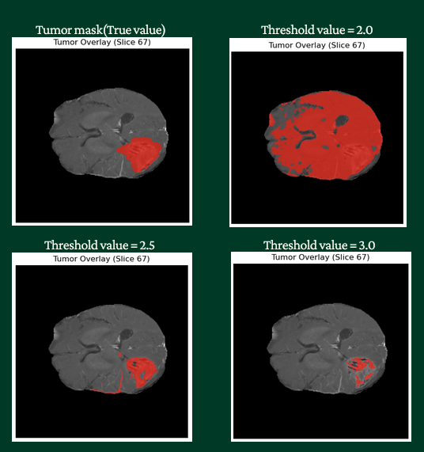

# 🧠 MRI Tumor Segmentation & Visualization

An automated medical imaging analysis tool that uses computer vision techniques to detect, segment, and visualize brain tumors from MRI scans. The system processes NIfTI format brain MRI data and generates tumor analysis reports with multi-view visualizations.

## 🔬 How Does It Work?

This project combines image processing algorithms and morphological operations to identify tumor regions in brain MRI scans(no segmentation models this go around). It supports both automatic segmentation using adaptive thresholding and manual segmentation using pre-labeled tumor masks.

## 🛠️ System Architecture

The system can be broken down into **five main components**:

### 1️⃣ MRI Data Loading & Preprocessing
- **Purpose:** Import and prepare NIfTI format MRI scans for analysis
- **Process:**
  - Loads 3D MRI volumes using the NiBabel library
  - Extracts affine transformation matrices for spatial calibration
  - Calculates voxel dimensions for accurate volume measurements

### 2️⃣ Tumor Segmentation
The project offers two segmentation approaches:

#### Automatic Segmentation
- **Technique:** Otsu's thresholding with adaptive adjustment
- **Process:**
  1. Normalizes MRI intensity values to 0-1 range
  2. Applies Otsu's method to determine optimal threshold
  3. Adjusts threshold by a configurable factor (default: 2.0-2.5x)
  4. Creates binary mask of potential tumor regions
- **Refinement:** Morphological operations clean up the mask:
  - Removes small isolated objects (< 100 voxels)
  - Applies binary closing with spherical structuring element
  - Identifies largest connected component as primary tumor

#### Manual Segmentation
- **Purpose:** Uses expert-labeled tumor masks for validation
- **Features:**
  - Loads pre-existing tumor masks in NIfTI format
  - Automatically resamples masks to match MRI dimensions
  - Validates mask-MRI alignment

### 3️⃣ Statistical Analysis
- **Tumor Volume Calculation:**
  - Voxel counting with precise spatial calibration
  - Converts to both cubic millimeters and cubic centimeters
- **Dimensional Analysis:**
  - Calculates tumor extent in all three axes (X, Y, Z)
  - Determines bounding box coordinates
  - Computes center of mass for tumor localization
- **Output Metrics:**
  - Total voxel count
  - Volume in mm³ and cm³
  - Physical dimensions in millimeters
  - Spatial bounds in voxel coordinates
  - Center of mass coordinates

### 4️⃣ Multi-View Visualization
The system generates comprehensive visualizations across three anatomical planes:

#### Axial View (Top-Down)
- Shows horizontal slices through the brain
- Ideal for viewing tumor cross-sections
- Automatically selects slice with largest tumor area

#### Coronal View (Front-Back)
- Displays frontal brain sections
- Useful for understanding anterior-posterior tumor extent
- Shows tumor position relative to brain structures

#### Sagittal View (Side)
- Presents lateral brain slices
- Reveals tumor depth and vertical extent
- Helpful for surgical planning perspectives

**Visualization Features:**
- Side-by-side comparison: original MRI vs. tumor overlay
- Red semi-transparent overlay (70% opacity) for clear tumor visualization
- Intelligent slice selection prioritizing maximum tumor visibility
- High-resolution output (300 DPI) for clinical review

### 5️⃣ Results Export & Documentation
- **Statistical Report:** Text file with complete tumor metrics
- **2D Visualization:** Best single-slice view with overlay
- **3D Multi-View:** Six-panel comprehensive visualization
- **Tumor Mask:** NumPy array for further analysis
- **Organized Output:** Separate directories for automatic vs. manual segmentation results

## 📊 Technical Implementation Details

### Image Processing Pipeline
The segmentation algorithm employs several key techniques:
- **Normalization:** Scales intensity values for consistent thresholding
- **Adaptive Thresholding:** Uses Otsu's method with adjustable sensitivity
- **Morphological Operations:** 
  - `remove_small_objects`: Eliminates noise artifacts
  - `binary_closing`: Fills holes within tumor regions
- **Connected Component Analysis:** Isolates the primary tumor mass
- **Fast Fourier Transform:** (Referenced in context but not directly used in this version)

### Data Formats
- **Input:** NIfTI (.nii) files - standard medical imaging format
- **Output:** PNG images (300 DPI), text reports, NumPy arrays
- **Coordinate Systems:** Maintains proper spatial orientation using affine matrices

### Key Libraries
- **nibabel:** Medical imaging file I/O
- **scikit-image:** Image processing and morphological operations
- **NumPy:** Numerical computations and array operations
- **Matplotlib:** Visualization and figure generation
- **SciPy:** Image resampling and interpolation

## :chart_with_downwards_trend: Exploring Output
Now that we've discussed all the techincal jargin of the project. It's time to see how it actaully preformed. And As you can see from the image below. Not so great.

## 📚 Lessons Learned

This project marked a significant turning point in my academic journey and sparked a genuine passion for medical imaging and neuroscience. Working with real MRI data and developing algorithms to detect potentially life-threatening conditions gave the work a profound sense of purpose.

**Technical Growth:**
- **Medical Imaging Fundamentals:** Understanding NIfTI formats, spatial transformations, and anatomical coordinate systems
- **Computer Vision Techniques:** Hands-on experience with segmentation, thresholding, morphological operations, and connected component analysis
- **Algorithm Optimization:** Balancing sensitivity vs. specificity in tumor detection, learning when automatic methods excel and when expert validation is necessary

**Domain Knowledge:**
- **Brain Anatomy:** Learning to interpret axial, coronal, and sagittal views and understanding spatial relationships in neuroimaging
- **Clinical Applications:** Recognizing how volume measurements and tumor localization inform treatment decisions

**Personal Impact:**
This project, combined with my concurrent EEG brain-computer interface work (see [Whatcha Thinkin?](https://github.com/Er1ckD1az/Whatcha-Thinkin)), solidified my fascination with the human brain. The brain truly is the most remarkable organ - not just for its complexity, but for how technology can help us understand and treat its pathologies. While the EEG project showed me the brain's electrical activity and sparked my interest, this MRI segmentation project revealed the intersection of computer science and clinical medicine, demonstrating how algorithms can assist in potentially life-saving diagnoses.

The experience taught me that the most rewarding projects are those that combine technical challenges with real-world impact. There's something uniquely motivating about writing code that could one day contribute to medical research or patient care.

**Future Directions:**
Moving forward, I'm excited to explore more advanced techniques like deep learning-based segmentation (U-Net, 3D CNNs) and multimodal imaging fusion. The field of medical imaging AI is rapidly evolving, and this project provided a solid foundation for understanding both the possibilities and the responsibilities that come with developing healthcare technology.

---

*Note: This project was developed as part of my exploration into medical imaging and neuroscience. It demonstrates proof-of-concept tumor segmentation techniques and should not be used for clinical diagnosis without proper validation and regulatory approval.*
